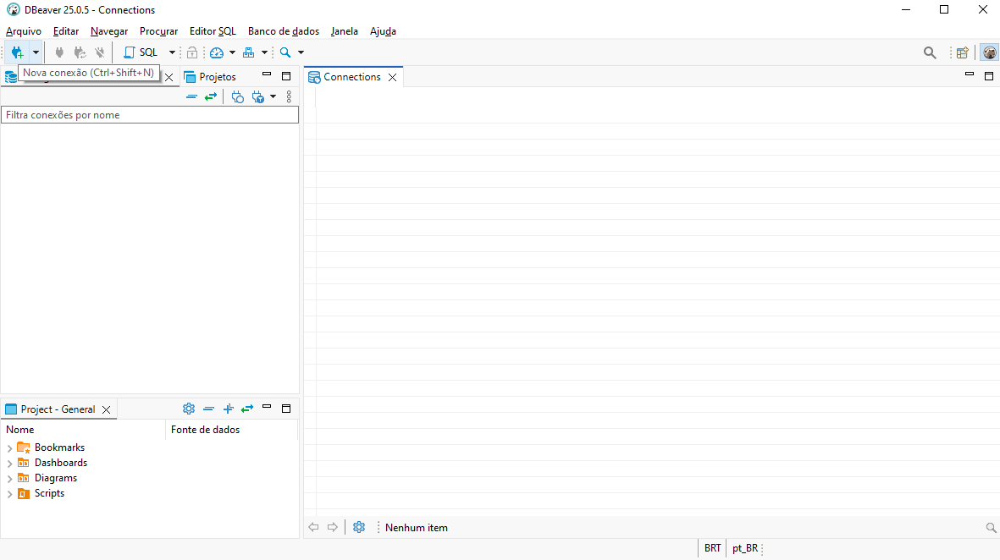

# 2025.1-Call of Cthulhu

Repositório do grupo 1 de Banco de Dados 1 para desenvolvimento do jogo inspirado nos RPGs de Call of Cthulhu.

## Descrição

Com base no universo criado por HP Lovecraft, Call of Cthulhu busca contar a história de um personagem principal que enfrenta criaturas sobrenaturais enquanto soluciona missões de outros personagens. O jogo foi modelado com base em um RPG, assim os personagens, montros e itens possuem caracteristicas semelhantes as presentes nos livros de mestre.

## Entregas

### Entrega 1

- [Diagrama entidade relacionamento](./docs/entregas/modelos/DER_Total.brM3)
- [Modelo entidade relacionamento](./docs/entregas/MER.md)
- [Dicionário de Dados]()

## Integrantes

<table> 
  <tr> 
    <td align="center"><a href="https://github.com/Cayoalencar"> <b>Cayo</b></a></td> 
    <td align="center"><a href="https://github.com/wChrstphr"> <b>Christopher</b></a></td> 
    <td align="center"><a href="https://github.com/igorvdaniel"> <b>Igor</b></a></td> 
    <td align="center"><a href="https://github.com/JJOAOMARCOSS"> <b>João Marcos</b></a></td> 
    <td align="center"><a href="https://github.com/luizfaria1989"> <b>Luiz Guilherme</b></a></td> 
  </tr> 
</table>
