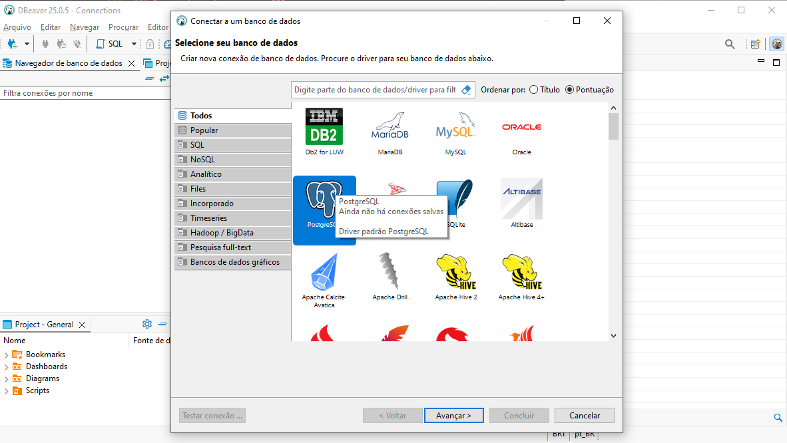
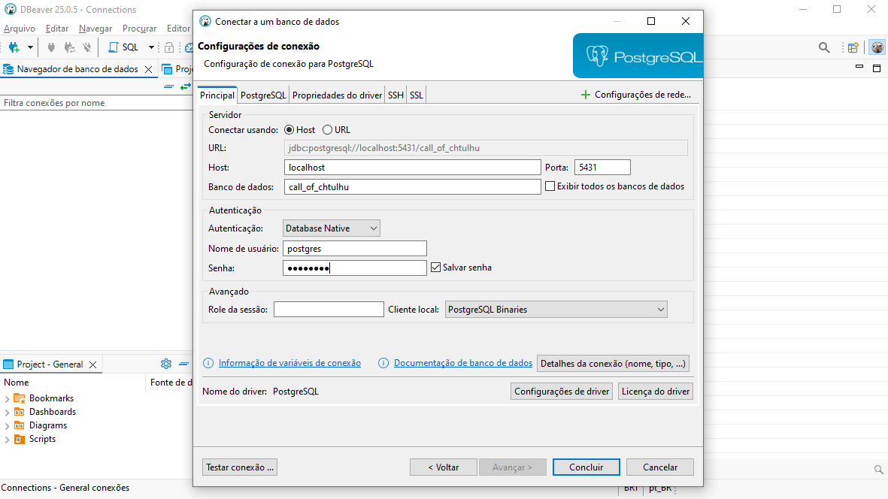

# 2025.1-Call of Cthulhu

Repositório do grupo 1 de Banco de Dados 1 para desenvolvimento do jogo inspirado nos RPGs de Call of Cthulhu.


## Descrição

Com base no universo criado por HP Lovecraft, Call of Cthulhu busca contar a história de um personagem principal que enfrenta criaturas sobrenaturais enquanto soluciona missões de outros personagens. O jogo foi modelado com base em um RPG, assim os personagens, montros e itens possuem caracteristicas semelhantes as presentes nos livros de mestre.

## Entregas
### Entrega 1

- [Diagrama entidade relacionamento](./docs/entregas/primeira/DER.md)
- [Modelo entidade relacionamento](./docs/entregas/primeira/MER.md)
- [Modelo lógico](./docs/entregas/primeira/ML.md)
- [Dicionário de Dados](./docs/entregas/primeira/DD.md)

## Integrantes

<table> 
  <tr> 
    <td align="center"><a href="https://github.com/Cayoalencar"><br /><sub><b>Cayo</b></sub></a></td> 
    <td align="center"><a href="https://github.com/wChrstphr"><br /><sub><b>Christopher</b></sub></a></td> 
    <td align="center"><a href="https://github.com/igorvdaniel"><br /><sub><b>Igor</b></sub></a></td> 
    <td align="center"><a href="https://github.com/JJOAOMARCOSS"><br /><sub><b>João Marcos</b></sub></a></td> 
    <td align="center"><a href="https://github.com/luizfaria1989"><br /><sub><b>Luiz Guilherme</b></sub></a></td> 
  </tr> 
</table>

## Como rodar o banco com o Docker
1. Tenha instalado o [Docker Engine](https://docs.docker.com/engine/install/)
1. No terminal e com o Docker rodando, execute o seguinte comando para rodar o container em modo _detached_, em background:
    ````bash
    docker compose up -d
    ```` 
1. A estrutura segue o seguinte padrão: ``docker exec -it <container-name> psql -U <DB_user> <DB_name>``. Para acessar o banco pelo psql, rode:
    ````bash
    docker exec -it 20251-callofcthulhu-db-1 psql -U postgres call_of_chtulhu
    ````
**Obs**: caso o passo 3 não funcione, troque "20251-callofcthulhu-db-1", pelo nome criado pelo seu docker. Para isso, rode ``docker ps -a``, pegue o nome do container que está rodando e troque pelo comando do passo 3.

---

### Como rodar o banco com o DBBeaver
O DBBeaver é uma plataforma gratuíta para trabalhar com bancos de dados, com suporte para múltiplos SQL databases, assim como o PostgreSQL.
1. Acesse o site e [baixe o DBBeaver](https://dbeaver.io/download/)
1. Após ter concluído os passos 1, 2 e 3 passados. Faça a conexão com o database da seguinte maneira:<br>
    1. Clique em nova conexão
    
    1. Selecione o Postgres
    
    1. Preencha as informações do banco, são as mesmas do arquivo ``docker-compose.yml``
    
1. Clique em **Test Connection** para garantir que está funcionando e depois em **Finish**
1. Agora você poderá:
    - Visualizar os schemas (`game`, `player`, `public`)
    - Navegar entre as tabelas, views, etc.
    - Executar scripts SQL diretamente pelo editor do DBeaver

---------------

### Como rodar scripts SQL no banco

Depois que o banco está rodando via Docker, você pode aplicar scripts SQL necessários com este comando:
```bash
docker exec -i <nome-do-container> psql -U postgres -d call_of_chtulhu -f <caminho-do-arquivo.sql>
```

Por exemplo, para rodar o script de criação do banco (createdb.sql):
```bash
docker exec -i 20251-callofcthulhu-db-1 psql -U postgres -d call_of_chtulhu -f ./db/createdb.sql
```

Se der erro de nome do container, use:
```bash
docker ps -a
```

# Comandos básicos no psql (dentro do container)
Para entrar no terminal interativo do banco:

```bash
docker exec -it 20251-callofcthulhu-db-1 psql -U postgres -d call_of_chtulhu
```
Dentro do psql, alguns comandos úteis:

| Comando                 | O que faz                     |
| ----------------------- | ----------------------------- |
| `\l`                    | Lista os bancos de dados      |
| `\c nome_do_banco`      | Conecta em outro banco        |
| `\dt`                   | Lista tabelas no schema atual |
| `\d nome_tabela`        | Mostra detalhes da tabela     |
| `\dn`                   | Lista schemas                 |
| `\du`                   | Lista roles                   |
| `\q`                    | Sai do psql                   |
| `SELECT * FROM tabela;` | Consulta dados da tabela      |

# Restaurar backups usando Docker
Se quiser restaurar um backup .dump usando pg_restore:
```bash
docker exec -i 20251-callofcthulhu-db-1 pg_restore -U postgres -d call_of_chtulhu < backup.dump
```