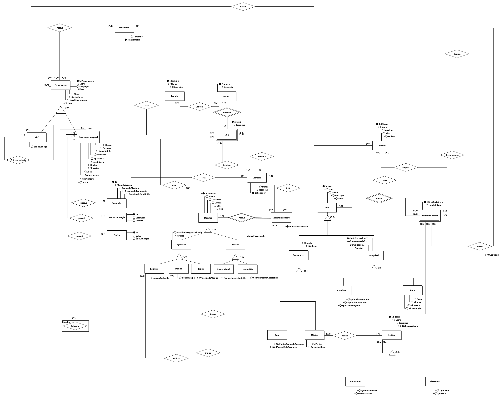

# Entrega 1

## Histórico de versões

| Versão |    Data    | Descrição               | Autor                                                                                                                 |
| :----: | :--------: | ----------------------- | --------------------------------------------------------------------------------------------------------------------- |
| `0.1`  | 02/05/25 |  Atualizando imagem do DER total  |        Equipe                |
| `0.2`  | 02/05/25 | Atualizando as imagens do documento | [Luiz Guilherme](https://github.com/luizfaria1989) |
| `0.3`  | 02/05/25 | Atualizando as imagens | [João Marcos](https://github.com/JJOAOMARCOS) |

## Prototipos Iniciais de Cada Conjunto de Entidades de Call of Ctchullu
### Monstros
<figure markdown="span">
{ width="700" }
  <figcaption>DER monstros</figcaption>
</figure>

---

### Itens
<figure markdown="span">
{ width="700" }
  <figcaption>DER itens</figcaption>
</figure>

---

### Região
<figure markdown="span">
{ width="700" }
  <figcaption>DER região</figcaption>
</figure>

---

### Missões
<figure markdown="span">
{ width="700" }
  <figcaption>DER missões</figcaption>
</figure>

---

### Personagem
<figure markdown="span">
{ width="700" }
  <figcaption>DER personagem</figcaption>
</figure>

### Total
<figure markdown="span">

  <figcaption>DER completo</figcaption>
</figure>
